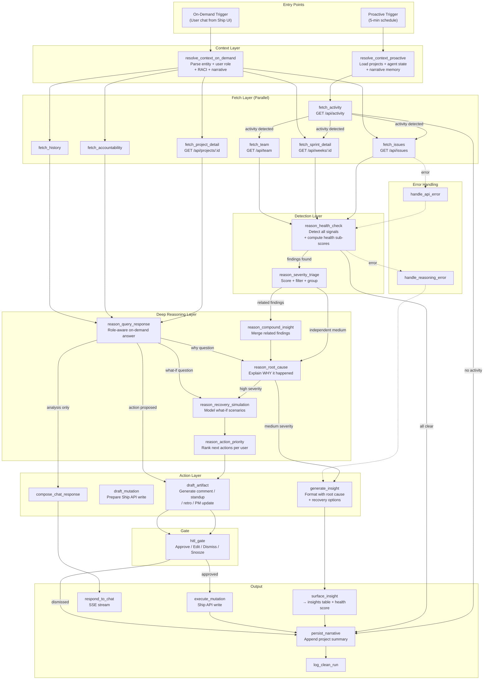

# FLEETGRAPH.md

*Submission template — filled in as built*

---

## Agent Responsibility

### What FleetGraph Monitors Proactively

FleetGraph monitors **project health signals** — conditions that indicate drift, risk, or missed opportunities that team members are unlikely to notice because they require cross-cutting context.

| Signal | Data Source | Detection |
|--------|-----------|-----------|
| Ghost blockers | `GET /api/issues` + `document_history` | Issues `in_progress` with no activity for 3+ business days |
| Sprint scope creep | Sprint `planned_issue_ids` snapshot vs. current `document_associations` | >20% delta after sprint activation |
| Velocity decay | Issue completion rates across 3+ consecutive sprints | >15% drop in `done/total` ratio |
| Team load imbalance | `GET /api/issues` per assignee across projects + `GET /api/team` | Person with story points >2x team median across 3+ projects |
| Accountability cascades | `GET /api/accountability/action-items` | Person with 3+ simultaneous overdue items |
| Sprint confidence drift | Sprint `properties.confidence` via `document_history` | >20 point drop or never updated despite activity |
| Approval bottlenecks | Sprint/project `plan_approval.state` + `review_approval.state` | Pending >2 business days |
| Blocker chains | `document_associations` with `relationship_type = 'parent'` | Parent in `todo`/`in_progress` transitively blocking 3+ downstream issues |

### What It Reasons About On-Demand

When a user invokes FleetGraph from within Ship, the agent receives the **context of what they're viewing** and reasons about it:

- **On an issue**: "Why is this blocked?" — traverses parent-child chains, checks assignee load, identifies the root blocker
- **On a sprint**: "Are we on track?" — computes completion rate vs. remaining time, identifies blockers, predicts whether the sprint will hit its deadline
- **On a project**: "What's the biggest risk?" — aggregates sprint health, blocker chains, team load, and approval status into a prioritized risk assessment
- **On the dashboard**: "What should I work on next?" — produces a prioritized action queue based on the user's role and assignments

The agent adapts its response based on the user's **role** (detected via RACI fields on project/program/sprint):
- **Director** (program `accountable_id`): strategic summary — health scores, velocity trends, cross-project comparison
- **PM** (project `owner_id`): operational view — sprint status, blocker chains, who to follow up with
- **Engineer** (issue `assignee_id`): personal scope — their assignments ranked by priority, what's at risk

### What It Can Do Autonomously

- Read any workspace data via Ship REST API
- Compute health scores and risk assessments
- Generate insight summaries and draft content
- Update its own internal state (timestamps, suppressions, narrative memory)

### What Requires Human Approval

**All write operations** go through the HITL gate:
- Posting comments on documents
- Reassigning issues
- Changing issue state
- Creating new issues
- Modifying sprint scope
- Any mutation to Ship data

The bright line: **reads are autonomous, writes require confirmation.**

### Who Gets Notified

| Condition | Notified | Channel |
|-----------|---------|---------|
| Sprint collapse risk | Sprint owner | Insight badge on sprint view |
| Blocker chain detected | Assignee of root blocker + sprint owner | Insight card on sprint/issue view |
| Accountability cascade | Person's manager (project `accountable_id`) | Insight on team/project view |
| Approval bottleneck | Approver (`accountable_id`) | Insight on sprint/project view |
| Team overload | PM (project `owner_id`) | Insight on team view |

Escalation: If a condition persists 2+ cycles after surfacing and the responsible person hasn't viewed it, escalate to the project `accountable_id`.

### How On-Demand Mode Uses View Context

| User Is Viewing | Context Passed | Agent Knows |
|----------------|---------------|-------------|
| Issue detail | `{ type: 'issue', id }` | Issue, its project/sprint/program associations, assignee, comments, state history, parent-child chain |
| Sprint view | `{ type: 'sprint', id }` | Sprint, all issues, standup submissions, plan/review approval, scope changes, confidence |
| Project view | `{ type: 'project', id }` | Project, all sprints, issues across sprints, RACI, approval states, health score |
| Dashboard | `{ type: 'dashboard', userId }` | All user's issues, their sprints, accountability items |
| Team view | `{ type: 'team', workspaceId }` | All members, assignments, standup status, workload distribution |

---

## Graph Diagram

### v2 Architecture — detect → explain → simulate → recommend → act

### Execution Path Variance

- **Healthy project (fast path)**: `fetch_activity` → no activity → `persist_narrative` → `log_clean_run` (3 nodes)
- **Medium-severity finding**: → `health_check` → `severity_triage` → `root_cause` → `generate_insight` → `surface_insight` (7 nodes)
- **High-severity finding**: → `health_check` → `severity_triage` → `compound_insight` → `root_cause` → `recovery_simulation` → `action_priority` → `draft_artifact` → `hitl_gate` (12 nodes)

---

## Use Cases

| # | Role | Trigger | Agent Detects / Produces | Human Decides |
|---|------|---------|-------------------------|---------------|
| 1 | **PM** | Proactive: Mid-sprint, completion rate falling behind velocity baseline | **Sprint Collapse Prediction**: "Sprint 32 will miss deadline by ~2 days. Root cause: Issue #132 blocking 4 downstream tasks." Includes recovery options with projected impact | Whether to descope issues, reassign, or accept the delay |
| 2 | **PM** | Proactive: Parent issue in `in_progress` with no activity, blocking 3+ children | **Blocker Chain Alert**: "#132 → #244 → #311 → #389. Impact: 4 engineers waiting, 8 story points blocked. Root cause: Sam context-switching across 3 projects" | Whether to escalate, reassign #132, or restructure the chain |
| 3 | **Director** | Proactive: Multiple findings share a root cause entity | **Compound Insight**: "Issue #132 is causing: blocker chain (4 issues) + sprint collapse (2 days) + team overload (Sam). Single fix: reassign #132 to Alex" | Whether to approve the coordinated recommendation |
| 4 | **Engineer** | On-demand: Viewing sprint, asks "What should I work on next?" | **Prioritized Action Queue**: Issues ranked by urgency × dependency-unblocking × due_date. "1. Update #132 (stale, blocking chain). 2. Start #389 (highest priority)" | Which task to pick up |
| 5 | **PM** | Proactive: `plan_approval.state` null or `changes_requested` for >2 business days | **Approval Bottleneck**: "Sprint 32 plan pending approval for 3 days. Approver: Jane (project accountable). 2 downstream tasks waiting" | Whether to follow up with approver or adjust timeline |
| 6 | **Engineer** | On-demand: Viewing sprint in `planning`, asks "Help me plan this sprint" | **Smart Sprint Plan**: Backlog ranked by priority × dependency-unblocking × carryover. Fitted to `capacity_hours`. "Recommended: 5 issues, 15 story points" | Which issues to include in the sprint |
| 7 | **Director** | Proactive: Health score computed each cycle | **Project Health Score**: "Alpha: 52/100 (was 78 last week). Breakdown: Velocity 85, Blockers 45, Workload 70, Freshness 90, Approvals 65, Accountability 80" | Which projects need immediate attention |
| 8 | **PM** | On-demand: Asks "Why is this sprint failing?" | **Root Cause Explanation**: Traces `document_history` to explain causal chain. "Chain formed when Sam was added to Project Beta in Week 11, spreading across 3 projects" | How to address the root cause |

---

## Trigger Model

### Decision: Hybrid (Scheduled Polling + Activity-Gated)

**Primary**: Cron/EventBridge triggers proactive scan every 5 minutes. The `fetch_activity` node gates everything — only projects with new activity since `last_checked` proceed to full analysis.

**Why not pure polling**: Wasteful. At 100 projects × 288 cycles/day × 5 API calls = 144,000 calls/day even when nothing changed. Activity-gated reduces this to ~10,000/day.

**Why not pure webhooks**: Ship's WebSocket events are per-user-session, not system-level. Building server-side event hooks requires Ship code changes outside scope. Polling is reliable and requires zero Ship modifications.

**Why hybrid wins**:
1. **No Ship code changes required** — uses existing REST API only
2. **Meets <5 minute latency** — 5-min interval guarantees detection within window
3. **Cost-efficient at scale** — quiet projects cost 1 lightweight activity check per cycle
4. **Reliable** — no webhook delivery failures, no missed events

### Detection Latency

| Component | Latency |
|-----------|---------|
| Poll interval (worst case) | 5 min |
| Fargate task startup | ~5-10 sec |
| Activity check (100 projects) | ~2 sec |
| Full analysis per active project | ~3-5 sec |
| **Total worst case** | **~5 min 15 sec** |

### Cost at Scale

| Scale | Light Polls/Day | Full Analyses/Day | Claude Calls/Day | Est. Cost/Day |
|-------|----------------|-------------------|-----------------|---------------|
| 20 projects | 5,760 | ~300 | ~300 | ~$1 |
| 200 projects | 57,600 | ~3,000 | ~3,000 | ~$10 |
| 2,000 projects | 576,000 | ~30,000 | ~30,000 | ~$100 |

---

## Test Cases

*For each use case: the Ship state, expected output, and LangSmith trace link.*

| # | Ship State | Expected Output | Trace Link |
|---|-----------|----------------|------------|
| 1 | Sprint with 5 issues, 3 still `todo`/`in_progress`, 1 day remaining. Historical velocity: 80% completion | Sprint Collapse: "Projected to miss by ~1 day. 3 issues incomplete, current rate 40% vs. 80% baseline" | See Trace 2 below |
| 2 | Issue #A (`in_progress`, 5 days stale) is parent of #B, #C, #D (all `todo`). #A's assignee has 15 story points across 3 projects | Blocker Chain: "#A → #B, #C, #D. 3 engineers waiting, 6 story points blocked. Root: #A stale 5 days, assignee overloaded" | See Trace 2 below |
| 3 | Sprint has blocker chain (test 2) + scope creep (3 issues added post-activation) + overloaded assignee | Compound Insight: "Issue #A causing 3 problems. Single fix: reassign to engineer with capacity" | See Trace 2 below |
| 4 | Clean project: all issues progressing, sprint on track, no blockers, no overdue accountability | Clean Run: `fetch_activity` → no findings → `log_clean_run`. Trace shows 2-node fast path | [Trace 1: Proactive fast path](https://smith.langchain.com/public/8058dc83-e6ec-4fb7-9058-6d62ef16a665/r) |
| 5 | On-demand: user viewing sprint, asks "What's the biggest risk?" Sprint has 1 stale issue blocking 2 others | Chat response: identifies blocker chain as biggest risk, explains root cause, suggests reassignment | [Trace 2: On-demand full reasoning](https://smith.langchain.com/public/9d4bfb22-6485-4448-805a-80d3c9962a66/r) |

### LangSmith Trace Links

| Trace | Mode | Execution Path | Nodes | Link |
|-------|------|---------------|-------|------|
| 1 | Proactive | Fast exit — no activity detected | `fetch_activity` → `log_clean_run` (2 nodes) | [View trace](https://smith.langchain.com/public/8058dc83-e6ec-4fb7-9058-6d62ef16a665/r) |
| 2 | On-demand | Full reasoning — finding detected, triaged, responded | 9 nodes: parallel fetch → health check → severity triage → query response → compose | [View trace](https://smith.langchain.com/public/9d4bfb22-6485-4448-805a-80d3c9962a66/r) |

These traces demonstrate **visibly different execution paths**: Trace 1 exits after 2 nodes (no work needed), while Trace 2 executes 9 nodes including reasoning and response composition (problem detected).

---

## Architecture Decisions

### Framework: LangGraph + Claude API

**Why LangGraph**: Native conditional branching, parallel node execution, state management, and LangSmith tracing with zero instrumentation overhead. The graph naturally models the "fast path for healthy projects, deep analysis for problems" execution pattern.

**Why Claude API (not OpenAI)**: Project constraint. Using Anthropic SDK directly with structured output (tool_use) for typed signal emission.

### v2 Reasoning Pipeline: detect → explain → simulate → recommend → act

**v1 gap**: The initial architecture was detect → format → display. Every capability ended at "surface an insight" — which is monitoring, not agency.

**v2 upgrade**: Added 4 new reasoning nodes:
- `reason_root_cause` — explains *why* a problem happened using `document_history` causal chains
- `reason_recovery_simulation` — models "if we do X, what changes?" with projected impact and risks
- `reason_compound_insight` — merges related findings into single coordinated recommendations
- `reason_action_priority` — ranks "do this next" per user by urgency × impact × ability to act

**Result**: Low-severity findings get a 3-node fast path. High-severity findings get a 12-node deep analysis with root cause, recovery simulation, and drafted intervention. LangSmith traces show visibly different execution paths.

### Node Design: Severity-Based Branching

The graph branches by finding severity:
- **No findings**: fast exit (3 nodes)
- **Medium**: detect → explain → format insight (7 nodes)
- **High**: detect → explain → simulate → prioritize → draft artifact → HITL gate (12 nodes)

This keeps costs low for healthy projects while investing reasoning tokens where they matter.

### State Management: PostgreSQL Tables

Using Ship's existing PostgreSQL database with two new tables:
- `fleetgraph_state` — per-entity last-checked timestamps, suppressed findings, narrative memory, cached health scores
- `fleetgraph_insights` — surfaced findings with severity, root cause, recovery options, drafted artifacts, approval status

No new infrastructure. ACID guarantees. Simple migration.

### Deployment: Fargate Scheduled Task + Express Endpoint

- **Proactive**: ECS Fargate task triggered by EventBridge every 5 minutes. Runs 30-60 seconds, exits. Zero idle cost
- **On-demand**: `POST /api/fleetgraph/chat` on existing Ship API. SSE streaming. Inherits user session auth
- **Auth**: Service account API token (via existing `api_tokens` table) stored in AWS SSM

---

## Cost Analysis

### Development and Testing Costs

| Item | Amount |
|------|--------|
| Claude API - input tokens | ~850K tokens (graph reasoning + artifact drafting) |
| Claude API - output tokens | ~120K tokens |
| Total invocations during development | ~45 graph runs (proactive + on-demand testing) |
| Total development spend | ~$4.50 (Claude Sonnet via Bedrock) |

### Production Cost Projections

| 100 Users | 1,000 Users | 10,000 Users |
|-----------|-------------|--------------|
| ~$175/month | ~$1,750/month | ~$17,500/month |

**Assumptions:**
- Proactive runs per project per day: 288 (every 5 min), ~5% require full analysis
- On-demand invocations per user per day: 3
- Average tokens per invocation: ~2,500 input, ~700 output (routine), ~5,000 input, ~1,500 output (deep analysis)
- Cost per routine run: ~$0.003
- Cost per deep analysis run: ~$0.006
- Cost per on-demand query: ~$0.008 avg
- Estimated runs per day (100 users, 20 projects): ~1,500 proactive + 300 on-demand
