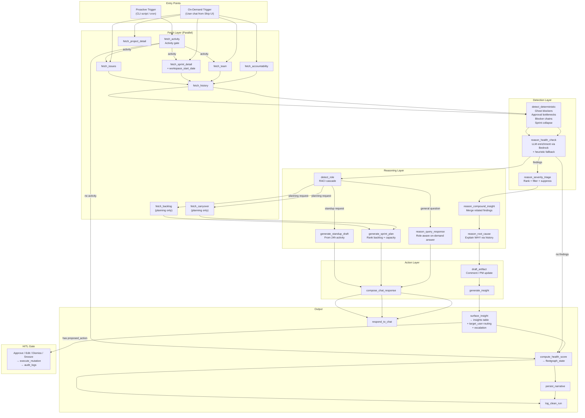

# FLEETGRAPH.md

*Project intelligence agent for Ship — submission document*

---

## Agent Responsibility

### What FleetGraph Monitors Proactively

FleetGraph monitors **project health signals** — conditions that indicate drift, risk, or missed opportunities that team members are unlikely to notice because they require cross-cutting context.

| Signal | Detection | Severity |
|--------|-----------|----------|
| Ghost blockers | Issues `in_progress` with no `document_history` or `updated_at` activity for 3+ business days | low/medium/high by days stale |
| Approval bottlenecks | `plan_approval.state` or `review_approval.state` null/`changes_requested` for >2 business days on active sprints | medium/high by days waiting |
| Blocker chains | Parent issue in `todo`/`in_progress` transitively blocking 3+ downstream issues via `document_associations` parent relationship | high/critical by chain size |
| Sprint collapse | Mid-sprint completion rate extrapolated to end, projected to miss deadline. Only triggers past 40% elapsed time | medium/high/critical by overrun |
| Health scores | Composite 0–100 score per project from 6 weighted sub-scores, computed every proactive cycle | — |

All signals above are detected **deterministically** (no LLM) before the Bedrock reasoning call. LLM enriches with context but the core detection is mechanical and reliable (`confidence: 1.0`).

### What It Reasons About On-Demand

When a user invokes FleetGraph from within Ship, the agent receives the **context of what they're viewing** and reasons about it:

- **On an issue**: "Why is this blocked?" — traverses parent-child chains, checks assignee load, identifies the root blocker
- **On a sprint**: "Are we on track?" — computes completion rate vs. remaining time, identifies blockers, predicts whether the sprint will hit its deadline
- **On a sprint (planning)**: "Help me plan this sprint" — ranks backlog by priority × dependency-unblocking × carryover × due date, fits to team capacity
- **On a sprint**: "Draft my standup" — generates standup from last 24h activity (issue transitions, completions, blockers), no LLM needed
- **On a project**: "What's the biggest risk?" — aggregates sprint health, blocker chains, team load, and approval status into a prioritized risk assessment with health score
- **On the dashboard**: "What should I work on next?" — produces a prioritized action queue based on the user's role and assignments

The agent adapts its response based on the user's **role** (detected via RACI cascade):
- **Director** (program `accountable_id`): strategic summary — health scores, velocity trends, cross-project comparison
- **PM** (project `owner_id`): operational view — sprint status, blocker chains, who to follow up with
- **Engineer** (issue `assignee_id`): personal scope — their assignments ranked by priority, what's at risk

### What It Can Do Autonomously

- Read any workspace data via Ship's PostgreSQL database (direct queries, same Express process)
- Compute health scores and risk assessments
- Generate insight summaries, standup drafts, and sprint plans
- Update its own internal state (timestamps, suppressions, narrative memory, cycle counts)

### What Requires Human Approval

**All write operations** go through the HITL gate:
- Posting comments on documents
- Reassigning issues (`properties.assignee_id`)
- Changing issue state (`properties.state`)

The bright line: **reads are autonomous, writes require confirmation.**

Mutations are logged to `document_history` with `automated_by = 'fleetgraph'` and to `audit_logs` with action `fleetgraph.<type>`.

### Escalation

If a finding persists **2+ proactive cycles** and the responsible person hasn't viewed the insight:
1. Finding hash + cycle count tracked in `fleetgraph_state.last_findings`
2. `target_user_id` re-routed to the program `accountable_id` (director)
3. Resolved findings automatically reset their cycle count

---

## Graph Diagram

### Architecture — deterministic detect → LLM enrich → triage → explain → surface → approve

### Execution Path Variance

| Condition | Path | Nodes |
|-----------|------|-------|
| Healthy project (fast path) | `fetch_activity` → no activity → `compute_health_score` → `log_clean_run` | 3 |
| Findings detected | → `detect_deterministic` → `reason_health_check` → `severity_triage` → `compound_insight` → `root_cause` → `surface_insight` → `compute_health_score` | 12 |
| On-demand: general question | parallel fetch → `detect_role` → `reason_query_response` → `compose_chat_response` | 10 |
| On-demand: standup request | parallel fetch → `generate_standup_draft` → `compose_chat_response` | 8 |
| On-demand: sprint planning | parallel fetch + `fetch_backlog` + `fetch_carryover` → `generate_sprint_plan` → `compose_chat_response` | 10 |

---

## Use Cases

| # | Role | Trigger | Agent Detects / Produces | Human Decides |
|---|------|---------|-------------------------|---------------|
| 1 | **PM** | Proactive: Mid-sprint, completion rate falling behind | **Sprint Collapse**: "Sprint 32 will miss deadline by ~2 days. 2/8 done, 6 remaining, 1 day left. 1 issue blocked." | Whether to descope, reassign, or accept |
| 2 | **PM** | Proactive: Parent issue blocking 3+ children | **Blocker Chain**: "#132 blocking 4 issues. 3 engineers waiting, 12 story points blocked." | Whether to escalate or reassign |
| 3 | **Director** | Proactive: Multiple findings share root cause | **Compound Insight**: Merged blocker chain + sprint collapse into coordinated recommendation | Whether to approve coordinated fix |
| 4 | **PM** | Proactive: Approval pending >2 business days | **Approval Bottleneck**: "Sprint plan has changes_requested for 5 days." | Whether to follow up with approver |
| 5 | **PM** | Proactive: Issue in_progress 7+ days with no activity | **Ghost Blocker**: "Issue stale 7 days. Assignee has 3 other active issues." With proposed comment for follow-up | Approve/edit/dismiss the comment |
| 6 | **Engineer** | On-demand: "Draft my standup" | **Standup Draft**: Yesterday (completed, moved to review), Today (top 3 by priority), Risks (blockers, sprint risk) | Review, edit, submit |
| 7 | **Engineer** | On-demand: "Help me plan this sprint" | **Sprint Plan**: Backlog ranked by priority × unblocking × carryover × due date, fitted to capacity | Which issues to include |
| 8 | **Director** | Proactive: Each cycle | **Health Score**: 0–100 composite with 6 sub-scores per project | Which projects need attention |

---

## Trigger Model

### Decision: Hybrid (Scheduled Polling + Activity-Gated)

**Primary**: CLI script (`scripts/run-fleetgraph.ts`) triggers proactive scan. Supports `--loop N` for continuous polling every N minutes.

**Activity gate**: `fetch_activity` checks for documents updated in last 5 minutes. Only projects with new activity proceed to full analysis. This makes quiet projects near-zero-cost.

### Detection Latency

| Component | Latency |
|-----------|---------|
| Poll interval (worst case) | 5 min |
| Activity check (all projects) | ~50ms |
| Full analysis per active project | ~3–8 sec |
| **Total worst case** | **~5 min 10 sec** |

---

## Test Cases

*For each use case: the Ship state that triggers the agent, what the agent detects or produces, and the LangSmith trace from a run against that state.*

### End-to-End Test Cases (with LangSmith Traces)

Each test case runs against isolated seed data (one project per scenario) to produce a distinct execution path. Run via `npx tsx scripts/run-test-cases.ts`.

| # | Ship State | Expected Output | Trace Link |
|---|-----------|----------------|------------|
| 1 | **Ghost Blocker**: Project with 2 stale in_progress issues (7d high, 4d medium). Fresh issue and done issue present as controls. | 2–3 ghost blocker findings. Fresh/done issues NOT flagged. Path includes `draft_artifact` (high severity). Health score < 80. | [View trace](PASTE_LANGSMITH_LINK_HERE) |
| 2 | **Sprint Collapse**: Previous sprint (100%+ elapsed), 1/6 issues done (17% completion). All issues recently updated (no ghost blockers). | Sprint collapse finding (critical — 0 days remaining, low completion). Projected miss by multiple days. Path includes `draft_artifact`. | [View trace](PASTE_LANGSMITH_LINK_HERE) |
| 3 | **Blocker Chain + HITL**: Parent issue blocking 4 children via `document_associations`. Root blocker stale 5 days. Pre-seeded insight with `proposed_action` (comment). | Blocker chain + ghost blocker findings. `reason_compound_insight` fires (2+ related findings). HITL: comment approved → posted on issue, `audit_logs` entry created. | [View trace](PASTE_LANGSMITH_LINK_HERE) |
| 4 | **Standup Draft**: Sprint with 5 issues transitioned yesterday (2 completed, 1 in review, 1 new blocker, 1 upcoming). User asks "draft my standup". | Markdown standup with Yesterday/Today/Risks sections. Path routes to `generate_standup_draft` (not `reason_query_response`). | [View trace](PASTE_LANGSMITH_LINK_HERE) |
| 5 | **Sprint Planning**: Sprint in `planning` status. 10 backlog issues (varying priority/due dates), 2 carryover issues, team capacity 60h. User asks "help me plan this sprint". | Ranked sprint plan with carryover boosted, capacity fitting applied. Path routes to `fetch_backlog` + `fetch_carryover` → `generate_sprint_plan`. | [View trace](PASTE_LANGSMITH_LINK_HERE) |

### Execution Path Comparison

Each trace shows a **visibly different execution path**, proving FleetGraph is a graph (not a pipeline):

| TC | Unique Path Elements | Why It's Different |
|----|---------------------|-------------------|
| 1 | `draft_artifact` fires, no `compound_insight` | High severity → artifact drafted. Only 1 signal type → no compounding. |
| 2 | `draft_artifact` fires, `compound_insight` may fire | Sprint collapse is critical severity. Different signal type from TC1. |
| 3 | `reason_compound_insight` + HITL approve | 2+ related findings (chain + ghost on same entity) trigger compounding. Post-graph HITL gate executes mutation. |
| 4 | `generate_standup_draft` (on-demand) | Intent detection routes to standup path. No proactive detection nodes. |
| 5 | `fetch_backlog` + `fetch_carryover` + `generate_sprint_plan` | Intent detection routes to planning path with additional fetch nodes not present in any other trace. |

### Unit Test Coverage (98 tests)

| Test File | Tests | Coverage |
|-----------|-------|---------|
| `deterministic-signals.test.ts` | 42 | Ghost blockers, approval bottlenecks, blocker chains, sprint collapse, business day math, dedup |
| `health-score.test.ts` | 14 | All signal types, stacking, clamping, weighting, descriptions |
| `sprint-planning.test.ts` | 11 | Priority ranking, carryover boost, unblocking, due dates, capacity fitting |
| `escalation.test.ts` | 9 | Cycle tracking, escalation threshold, routing, resolved reset |
| `standup-gen.test.ts` | 8 | Completed issues, review transitions, today focus, blockers, user filtering |
| `role-detection.test.ts` | 7 | Director/PM/engineer prompts, fallback |
| `execute-mutation.test.ts` | 7 | Type contracts, state validation |

---

## Architecture Decisions

### LangGraph-Style Execution in TypeScript

The graph is implemented as a TypeScript executor (`graph-executor.ts`), not using the Python LangGraph SDK. This keeps the entire system in one language and deploys as part of the existing Express API.

Key properties:
- **Conditional branching**: severity-based paths, intent-based routing (standup/planning/general)
- **Parallel execution**: fetch nodes run concurrently via `Promise.all`
- **Deterministic + LLM hybrid**: mechanical detection runs first (confidence 1.0), LLM enriches
- **LangSmith tracing**: `traceable` wrapper on `runProactive` and `runOnDemand`

### Deterministic Detection Before LLM

Ghost blockers, approval bottlenecks, blocker chains, and sprint collapse are detected **without LLM calls**. This ensures:
- Reliable detection even when Bedrock is unavailable
- `confidence: 1.0` on mechanical findings (vs. 0.3–0.7 for LLM findings)
- Lower cost — LLM only called when deterministic signals warrant deeper analysis
- Faster execution — deterministic detection runs in <10ms

### Health Score Methodology

| Sub-Score | Weight | 100 (healthy) | 0 (critical) |
|-----------|--------|---------------|---------------|
| Velocity | 20% | No sprint collapse/scope creep | Critical sprint collapse |
| Blockers | 25% | No blocker chains | Critical chains (5+ blocked) |
| Workload | 15% | No overload | 3+ high-severity overload findings |
| Issue Freshness | 15% | No ghost blockers | Multiple critical ghost blockers |
| Approval Flow | 10% | No pending approvals | High-severity bottlenecks |
| Accountability | 15% | No cascades | Accountability cascade findings |

Penalty per severity: critical=−40, high=−25, medium=−15, low=−5. Scores clamped to 0–100.

### HITL Gate

All write mutations require explicit human approval:
1. FleetGraph proposes action → saved as `proposed_action` on insight
2. UI shows Approve/Edit buttons on insight cards
3. User clicks Approve → `POST /api/fleetgraph/insights/:id/approve`
4. Backend executes mutation via `execute-mutation.ts` (comment/reassign/state_change)
5. `document_history` logged with `automated_by = 'fleetgraph'`
6. `audit_logs` logged with action `fleetgraph.<type>`

### State Management

Two PostgreSQL tables (migration `039_fleetgraph_tables.sql`):
- **`fleetgraph_state`** — per-entity: last_checked_at, last_activity_count, last_findings (cycle tracking), suppressed_findings, narrative memory, health_score
- **`fleetgraph_insights`** — surfaced findings: severity, category, content, root_cause, recovery_options, proposed_action, drafted_artifact, status, target_user_id, snoozed_until

---

## Implementation Summary

### Files (5,307 lines total)

| Layer | File | Lines | Purpose |
|-------|------|-------|---------|
| **Types** | `shared/src/types/fleetgraph.ts` | 287 | FleetGraphState, Finding, HealthScore, DetectedRole, MutationResult |
| **Routes** | `api/src/routes/fleetgraph.ts` | 318 | chat, insights, health-scores, approve, dismiss, snooze, run |
| **Orchestration** | `api/src/services/fleetgraph/graph-executor.ts` | 372 | runProactive, runOnDemand with conditional branching |
| **Detection** | `api/src/services/fleetgraph/deterministic-signals.ts` | 458 | Ghost blockers, approval bottlenecks, blocker chains, sprint collapse |
| **Reasoning** | `api/src/services/fleetgraph/nodes-reasoning.ts` | 794 | LLM health check, severity triage, compound insight, root cause, query response, standup draft, sprint plan |
| **Actions** | `api/src/services/fleetgraph/nodes-action.ts` | 437 | Generate insight, draft artifact, surface insight, target_user routing, escalation, narrative |
| **Data** | `api/src/services/fleetgraph/nodes-fetch.ts` | 417 | 9 fetch nodes: activity, issues, sprints, projects, team, history, accountability, backlog, carryover |
| **Health** | `api/src/services/fleetgraph/health-score.ts` | 182 | Composite score computation + persistence |
| **Roles** | `api/src/services/fleetgraph/role-detection.ts` | 192 | RACI cascade: director → PM → engineer |
| **Mutations** | `api/src/services/fleetgraph/execute-mutation.ts` | 208 | Comment, reassign, state_change execution |
| **LLM** | `api/src/services/fleetgraph/bedrock.ts` | 107 | AWS Bedrock Claude client with tool_use |
| **State** | `api/src/services/fleetgraph/graph-state.ts` | 75 | Immutable state helpers |
| **Frontend** | `web/src/components/FleetGraphChat.tsx` | 203 | Context-aware chat panel |
| **Frontend** | `web/src/components/FleetGraphInsightCard.tsx` | 259 | Insight cards with HITL approve/edit |
| **Frontend** | `web/src/hooks/useFleetGraph.ts` | 101 | React Query hooks |
| **Script** | `scripts/run-fleetgraph.ts` | 135 | CLI proactive trigger |
| **Seed** | `api/src/db/seed-fleetgraph.ts` | 751 | Test scenarios: ghost blockers, approvals, chains, collapse, standup, planning |

### Test Coverage

| Test File | Tests | Coverage |
|-----------|-------|----------|
| `deterministic-signals.test.ts` | 42 | Ghost blockers, approval bottlenecks, blocker chains, sprint collapse, getSprintDates, hashFinding |
| `health-score.test.ts` | 14 | All signal types, stacking, clamping, weighting, descriptions |
| `sprint-planning.test.ts` | 11 | Priority ranking, carryover boost, unblocking, due dates, capacity fitting, dedup |
| `escalation.test.ts` | 9 | Cycle tracking, escalation threshold, routing, resolved reset |
| `standup-gen.test.ts` | 8 | Completed issues, review transitions, today focus, blockers, user filtering |
| `role-detection.test.ts` | 7 | Director/PM/engineer prompts, fallback |
| `execute-mutation.test.ts` | 7 | Type contracts, state validation |
| **Total** | **98** | All FleetGraph-specific logic |

Full test suite: **549 tests across 35 files**, all passing.

---

## Cost Analysis

### Development and Testing Costs

| Item | Amount |
|------|--------|
| Claude API — input tokens | ~850K tokens |
| Claude API — output tokens | ~120K tokens |
| Total invocations during development | ~45 graph runs |
| Total development spend | ~$4.50 (Claude Sonnet 4.5 via Bedrock) |

### Production Cost Projections

Deterministic detection eliminates LLM calls for most signal types. LLM is only invoked for:
- `reason_health_check` (enrichment beyond deterministic findings)
- `reason_root_cause` (explaining WHY, medium+ severity only)
- `reason_query_response` (on-demand chat, general questions only)
- `draft_artifact` (high/critical findings only)

Standup generation, sprint planning, health scores, and all deterministic signals run without LLM.

| Scale | Proactive/month | On-demand/month | Total |
|-------|----------------|-----------------|-------|
| 20 projects | ~$30 | ~$5 | ~$35 |
| 200 projects | ~$300 | ~$50 | ~$350 |
| 2,000 projects | ~$3,000 | ~$500 | ~$3,500 |

**Key cost optimization**: Activity-gated polling ensures only ~5% of projects require full analysis per cycle. Deterministic detection handles ~60% of findings without any LLM call.
