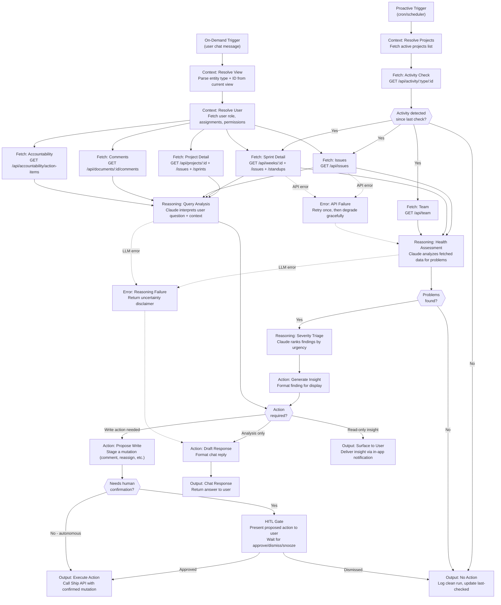

# PRESEARCH.md

**FleetGraph — A Project Intelligence Agent for Ship**

Pre-Search completed: 2026-03-16

---

## Phase 1: Define Your Agent

### 1. Agent Responsibility Scoping

#### What Ship events should the agent monitor proactively?

The agent monitors **project health signals** — conditions that indicate drift, neglect, or risk that team members are unlikely to notice on their own because they require cross-cutting context.

**Monitored conditions (proactive mode):**

| Signal | Ship Data Source | Detection Method |
|--------|-----------------|------------------|
| Stale issues | `GET /api/issues` — issues in `in_progress` or `in_review` with no `updated_at` change in N days | Compare `updated_at` against current time; threshold: 3 business days for in_progress, 2 for in_review |
| Sprint scope creep | `GET /api/weeks/:id/scope-changes` + `GET /api/weeks/:id/issues` | Compare issue count at sprint start vs. now; flag if >20% growth after sprint started |
| Missing standups | `GET /api/standups/status` + `GET /api/team` | Cross-reference team members against standup submissions for current day; flag after 11 AM if not submitted |
| Unapproved plans/retros | `GET /api/weeks/:id` — check `properties.plan_approval.state` | Flag sprints in `active` status where `plan_approval.state` is null (never submitted for review) |
| Unbalanced workload | `GET /api/issues` filtered by assignee + state | Count open issues per assignee; flag if any person has >2x the team median |
| Sprint completion risk | `GET /api/weeks/:id/issues` | With <2 days remaining in sprint, calculate % of issues still in `todo`/`in_progress`; flag if >40% incomplete |
| Accountability gaps | `GET /api/accountability/action-items` | Surface items from the inference engine that have been outstanding for >2 days |
| Blocked issues without resolution | `GET /api/issues` + `GET /api/documents/:id/comments` | Issues with `priority: urgent` that have unresolved comments older than 24 hours |

#### What constitutes a condition worth surfacing?

A condition is worth surfacing when **all three criteria** are met:

1. **Actionable** — There is a concrete next step a human can take (reassign, update status, post standup, approve plan)
2. **Time-sensitive** — Waiting another polling cycle would increase the cost of inaction (sprint deadline approaching, approval blocking downstream work)
3. **Not self-evident** — The person responsible doesn't already see this in their current view (cross-project context, aggregate patterns, things that require comparing data across entities)

The agent should **not** surface:
- Issues that are progressing normally (no news is good news)
- Items the user is actively editing (WebSocket awareness shows them online)
- Conditions that have already been surfaced and not yet dismissed (avoid nagging)

#### What the agent is allowed to do autonomously

**Autonomous (no confirmation):**
- Read any workspace data via Ship REST API
- Compute health scores and risk assessments
- Generate insight summaries
- Create draft comments on documents (saved as drafts, not posted)
- Update its own internal state (last-checked timestamps, suppression lists)

**Requires human confirmation (human-in-the-loop gate):**
- Posting comments on documents
- Reassigning issues
- Changing issue state (e.g., marking stale issues as `backlog`)
- Creating new issues (e.g., accountability issues)
- Sending notifications to other team members
- Modifying sprint scope (adding/removing issues)
- Any write operation to Ship data

The bright line: **reads are autonomous, writes require confirmation.**

#### How the agent knows who is on a project

Ship's data model provides this through associations and ownership:

1. **Project/Program owners**: `properties.owner_id` and `properties.accountable_id` on project/program documents
2. **RACI matrix**: `properties.consulted_ids[]` and `properties.informed_ids[]` on programs/projects
3. **Sprint owners**: `properties.owner_id` on sprint documents
4. **Issue assignees**: `properties.assignee_id` on issue documents
5. **Team roster**: `GET /api/team` returns all workspace members with their person documents
6. **Workspace memberships**: `GET /api/workspaces/:id/members` for roles (admin/member)

The agent resolves person documents → user IDs via `properties.user_id` on person documents.

#### Who gets notified and when

| Condition | Notified Role | Channel |
|-----------|--------------|---------|
| Stale issue (3+ days) | Issue assignee | In-app insight on issue view |
| Sprint at risk (<2 days, >40% incomplete) | Sprint owner | In-app insight on sprint view + dashboard |
| Missing standup (after 11 AM) | Individual team member | In-app insight on dashboard |
| Unapproved plan (sprint active) | Sprint owner + project owner | In-app insight on sprint view |
| Workload imbalance (>2x median) | Project owner / PM | In-app insight on team view |
| Scope creep (>20% growth) | Sprint owner | In-app insight on sprint view |

**Escalation**: If a condition persists for 2+ polling cycles after initial surfacing and the responsible person hasn't viewed it, escalate to the project `accountable_id` (the A in RACI).

#### How on-demand mode uses context from the current view

The on-demand chat is **context-scoped** — it receives the current view's entity as its starting node:

| User is viewing | Context passed to graph | Agent knows |
|----------------|------------------------|-------------|
| Issue detail page | `{ type: 'issue', id: '...' }` | The issue, its project/sprint/program associations, assignee, comments, state history |
| Sprint view | `{ type: 'sprint', id: '...' }` | The sprint, all its issues, standup submissions, plan/review approval state, scope changes |
| Project view | `{ type: 'project', id: '...' }` | The project, all sprints, all issues across sprints, RACI, retro/plan approvals |
| Dashboard (my-work) | `{ type: 'dashboard', userId: '...' }` | All issues assigned to user, their sprints, accountability items |
| Team view | `{ type: 'team', workspaceId: '...' }` | All members, their assignments, standup status, workload distribution |

The context node fetches the entity and its immediate associations (1 hop). The user's question determines whether the reasoning node needs to fetch deeper (2+ hops).

**Examples of on-demand queries:**
- On an issue: "Why is this blocked?" → Agent checks comments, linked issues, assignee's other work
- On a sprint: "Are we on track?" → Agent computes velocity, checks incomplete issues, compares to plan
- On a project: "Who's overloaded?" → Agent aggregates issue counts per assignee across all project sprints
- On dashboard: "What should I work on next?" → Agent prioritizes by urgency, due date, sprint deadline proximity

---

### 2. Use Case Discovery

| # | Role | Trigger | Agent Detects / Produces | Human Decides |
|---|------|---------|-------------------------|---------------|
| 1 | **PM** | Proactive: Sprint has <2 days remaining | **Sprint completion risk report**: Lists incomplete issues (todo/in_progress), calculates completion %, identifies which issues are blocking others, suggests which to carry over vs. push to finish | Whether to descope issues, reassign work, or extend sprint |
| 2 | **Engineer** | On-demand: Viewing an issue, asks "What's blocking this?" | **Dependency analysis**: Checks parent/child issues, linked project issues, unresolved comments, assignee's workload on other items. Produces a ranked list of blockers with suggested next actions | Whether to escalate, reassign, or resolve the blocker themselves |
| 3 | **Director** | Proactive: Weekly schedule (Monday 9 AM) | **Cross-project health digest**: For each active project, reports: sprint velocity trend (last 3 sprints), plan approval status, accountability compliance (standups, weekly plans), stale issue count. Flags projects that need attention | Which projects to review in weekly leadership meeting, where to intervene |
| 4 | **PM** | Proactive: Issue assignee has >2x median workload | **Workload imbalance alert**: Shows the overloaded person's issue list by priority, compares against team members with capacity, suggests specific reassignment options | Whether to reassign and to whom |
| 5 | **Engineer** | On-demand: Viewing a sprint, asks "Summarize what happened this sprint" | **Sprint retrospective draft**: Analyzes completed vs. planned issues, identifies what was carried over, highlights scope changes, computes plan accuracy. Produces structured retro content matching Ship's retro format | Whether to use the draft, edit it, or write their own |
| 6 | **PM** | Proactive: Sprint plan approved but 3+ issues added after approval | **Scope creep detection**: Lists issues added post-approval with timestamps, who added them, their total estimate. Calculates impact on sprint capacity | Whether to remove added issues, adjust plan, or accept the scope change |
| 7 | **Director** | On-demand: Viewing team page, asks "Who hasn't submitted standups this week?" | **Standup compliance report**: Cross-references all team members against standup submissions for current week. Shows per-person submission history, highlights patterns (consistently late, frequently missing) | Whether to follow up with individuals or adjust standup expectations |
| 8 | **Engineer** | On-demand: Viewing a project, asks "What should I pick up next?" | **Smart issue triage**: Ranks unassigned/backlog issues by: priority, sprint deadline proximity, dependency unblocking potential, estimate fit for remaining sprint capacity. Produces a prioritized shortlist | Which issue to assign themselves |

---

### 3. Trigger Model Decision

#### Options Evaluated

**Option A: Pure Polling**
- Agent runs on a fixed schedule (e.g., every 5 minutes), queries Ship API for all active projects/sprints, computes health signals
- Pros: Simple, reliable, works without Ship code changes
- Cons: Wasteful when nothing changed, N API calls per cycle regardless, cost scales linearly with project count
- Cost at 100 projects: ~288 runs/day × 5 API calls/project × 100 = 144,000 API calls/day
- Cost at 1,000 projects: 1,440,000 API calls/day (untenable)

**Option B: Pure Webhooks**
- Ship fires events on document create/update/delete, agent subscribes
- Pros: Zero-latency detection, no wasted cycles
- Cons: Requires Ship code changes (event emission), more complex infrastructure (webhook delivery, retry, ordering), webhook failures can cause missed events
- Ship currently has **no event system** — this would require significant code changes

**Option C: Hybrid (Polling + Activity-Gated)**
- Light poll every 5 minutes: check `GET /api/activity/{type}/{id}` for each active project — this returns daily activity counts, not full data
- Full analysis only when activity detected since last poll
- Daily deep scan (once per day at 8 AM) regardless of activity for drift detection
- Pros: Minimal API calls when projects are quiet, still catches everything, no Ship code changes needed
- Cons: Slightly more complex scheduling logic

#### Decision: **Hybrid (Option C)**

**Why:**
1. **No Ship code changes required** — The PRD says "Ship REST API is your data source." Webhooks would require modifying Ship's API layer, which is outside scope and adds coupling
2. **Meets <5 minute latency** — 5-minute poll interval guarantees detection within 5 minutes of any change
3. **Cost-efficient at scale** — Activity-gated polling means quiet projects cost almost nothing (1 lightweight activity check per cycle vs. 5+ data fetches)
4. **Reliable** — No webhook delivery failures, no event ordering issues, no missed events. If a poll fails, the next poll catches it

**Cost Estimates:**

| Scale | Light Polls/Day | Full Analyses/Day | API Calls/Day | Claude Invocations/Day | Est. Cost/Day |
|-------|----------------|-------------------|---------------|----------------------|---------------|
| 100 projects | 28,800 (288 cycles × 100) | ~1,440 (avg 5 active/cycle × 288) + 100 daily | ~10,000 | ~1,540 | ~$4.60 |
| 1,000 projects | 288,000 | ~14,400 + 1,000 daily | ~80,000 | ~15,400 | ~$46 |

Assumptions: 5% of projects have activity per 5-min cycle, full analysis = 5 API calls + 1 Claude call (~3K tokens), light poll = 1 API call (no Claude).

**Detection Latency Breakdown:**
- Worst case: Event occurs 1 second after poll → detected at next poll = 4 min 59 sec
- Average case: Event occurs mid-cycle → ~2 min 30 sec
- Best case: Event occurs just before poll → <5 sec
- All within the <5 minute requirement

---

## Phase 2: Graph Architecture

### 4. Node Design

#### Graph Structure (Both Modes)



#### Parallel Execution

**Fetch nodes that run in parallel:**
- `FETCH_ISSUES`, `FETCH_SPRINT`, `FETCH_TEAM` — independent data, no dependencies between them
- `FETCH_PROJECT`, `FETCH_COMMENTS`, `FETCH_ACCOUNTABILITY` — independent in on-demand mode

**Sequential dependencies:**
- Context nodes must complete before fetch nodes (need entity IDs)
- All fetch nodes must complete before reasoning nodes (need data to reason about)
- Reasoning must complete before action/output nodes

#### Conditional Branch Triggers

| Branch Point | Condition | True Path | False Path |
|-------------|-----------|-----------|------------|
| `COND_ACTIVITY` | `activity_count > 0` since last poll timestamp | Full fetch + reasoning | Skip to `OUTPUT_SILENT` |
| `COND_PROBLEMS` | Reasoning node returns `findings.length > 0` with severity >= `medium` | Triage + action | `OUTPUT_SILENT` |
| `COND_ACTION` | Finding includes a proposed mutation (not just an observation) | `ACTION_WRITE` → HITL | `ACTION_INSIGHT` → surface read-only |
| `COND_CONFIRM` | Mutation type is in the confirmation-required list (all writes except draft saves) | `HITL_GATE` | Direct execute (only for autonomous actions like updating agent state) |

---

### 5. State Management

#### State During a Single Graph Run

```typescript
interface FleetGraphState {
  // Trigger context
  mode: 'proactive' | 'on_demand';
  trigger_entity?: { type: string; id: string };  // on-demand: what user is viewing
  user_id?: string;                                // on-demand: who invoked
  user_role?: 'admin' | 'member';

  // Fetched data (populated by fetch nodes)
  projects: Project[];
  sprints: Sprint[];
  issues: Issue[];
  team_members: Person[];
  comments: Comment[];
  accountability_items: AccountabilityItem[];
  activity_summary: ActivitySummary;

  // Reasoning output
  findings: Finding[];              // problems/insights detected
  severity_ranking: RankedFinding[];  // after triage
  proposed_actions: ProposedAction[]; // write operations needing confirmation

  // Chat state (on-demand only)
  chat_history: Message[];
  current_query: string;
  response_draft: string;

  // Error state
  errors: { node: string; error: string; fallback_used: boolean }[];
}
```

#### State Persisted Between Proactive Runs

Stored in a lightweight persistence layer (PostgreSQL table or Redis):

```typescript
interface AgentPersistence {
  // Per-project tracking
  project_states: Map<string, {
    last_checked_at: ISO8601;
    last_activity_at: ISO8601;
    last_findings: Finding[];           // avoid re-surfacing same issues
    suppressed_findings: {              // user dismissed these
      finding_hash: string;
      suppressed_at: ISO8601;
      suppressed_until: ISO8601 | null; // null = permanent, date = snooze
    }[];
  }>;

  // Global
  last_full_scan_at: ISO8601;           // daily deep scan timestamp
  polling_cursor: string;               // which project to check next (round-robin)
}
```

#### Avoiding Redundant API Calls

1. **Activity-gated fetching**: The light poll (`GET /api/activity/:type/:id`) returns daily counts. Only fetch full data when `activity_count > last_known_count`
2. **ETag/If-Modified-Since**: If Ship supports conditional requests, use them (currently it doesn't, but the agent can track `updated_at` values)
3. **Fetch deduplication within a run**: If multiple use cases need the same entity, the state object acts as an in-memory cache — fetch once, reference from state
4. **Suppression list**: Don't re-analyze findings that were already surfaced and not yet resolved or dismissed

#### Caching Strategy

| Data | Cache Duration | Invalidation |
|------|---------------|--------------|
| Team roster | 1 hour | On workspace membership change |
| Project/program list | 15 minutes | On activity detected |
| Sprint detail | 5 minutes (per poll cycle) | On activity detected |
| Issue list | 5 minutes | On activity detected |
| Accountability items | No cache | Always fresh (inference-based) |

---

### 6. Human-in-the-Loop Design

#### Actions Requiring Confirmation

| Action | Why Confirmation Required |
|--------|-------------------------|
| Post a comment on a document | Visible to all workspace members; can't easily undo |
| Reassign an issue | Changes another person's workload |
| Change issue state | May affect sprint metrics and project tracking |
| Create a new issue | Adds to someone's backlog |
| Modify sprint scope (add/remove issues) | Affects sprint planning and commitments |
| Send a notification to another user | Interrupts someone's workflow |

#### Confirmation UX in Ship

The agent surfaces proposed actions as **inline cards** within the contextual chat panel (right side of the 4-panel layout):

```
┌─────────────────────────────────────────────┐
│  FleetGraph suggests:                       │
│                                             │
│  Post comment on ISSUE-142:                 │
│  "This issue has been in_progress for 5     │
│   days with no updates. @jane — is this     │
│   still active or should we move it back    │
│   to backlog?"                              │
│                                             │
│  [Approve & Post]  [Edit]  [Dismiss]        │
│                                             │
│  ⏰ Snooze: [1 day] [3 days] [1 week]      │
└─────────────────────────────────────────────┘
```

For proactive mode (user not actively in chat), the insight appears as a **badge/indicator** on the relevant entity in the sidebar navigation, with the full detail shown when the user navigates to that entity.

#### Dismiss and Snooze Behavior

| User Action | Effect |
|-------------|--------|
| **Approve** | Agent executes the proposed write via Ship API. Finding marked as resolved |
| **Edit** | User modifies the proposed content, then approves. Agent executes the edited version |
| **Dismiss** | Finding suppressed permanently for this specific condition. Agent won't re-surface it unless the underlying data changes significantly |
| **Snooze (1d/3d/1w)** | Finding suppressed until snooze expires. Agent re-evaluates at expiry and only re-surfaces if the condition persists |

Suppression is tracked in `AgentPersistence.project_states[].suppressed_findings` keyed by a hash of the finding type + entity ID.

---

### 7. Error and Failure Handling

#### Ship API Failures

```
Fetch Node Error → Retry (1x, 2s delay) → Still failed?
  ├── Partial data available → Continue with degraded reasoning
  │   (Reasoning node receives { available: [...], missing: [...] })
  │   LLM prompt includes: "Note: sprint data was unavailable. Analysis is based on issues and team data only."
  └── No data available → Skip this project, log error, continue to next
```

**Specific failure modes:**
- **401/403 (auth expired)**: Re-authenticate using service account API token. If token is invalid, halt all proactive runs and alert admin
- **404 (entity deleted)**: Remove from tracking, skip silently
- **429 (rate limited)**: Back off exponentially (5s, 15s, 45s). If persistent, reduce polling frequency
- **500 (server error)**: Retry once. If persistent across 3 cycles, create an internal alert (not surfaced to users)
- **Timeout (>10s)**: Treat as failure, retry once with shorter timeout

#### Incomplete Data

When the reasoning node receives partial data, it:
1. Explicitly states what data is missing in its analysis
2. Lowers confidence scores for findings that depend on missing data
3. Never proposes write actions based on incomplete data (read-only insights only)
4. Flags the gap: "Unable to assess sprint completion risk — issue data was unavailable"

#### Uncertain Reasoning Output

When Claude's analysis is low-confidence:
1. The reasoning node includes a `confidence: float` field (0-1) with each finding
2. Findings with `confidence < 0.6` are tagged as "possible" rather than "detected"
3. Low-confidence findings are never auto-escalated; they only appear in on-demand chat responses
4. The output includes reasoning transparency: "This assessment is uncertain because [reason]"

#### Fallback Hierarchy

```
Full analysis (all data + Claude reasoning)
  ↓ API partial failure
Degraded analysis (available data + Claude with caveats)
  ↓ Claude API failure
Rule-based analysis (heuristic checks: stale >3 days, >40% incomplete, etc.)
  ↓ All APIs down
Cached last-known state + "Data unavailable" message
```

---

## Phase 3: Stack and Deployment

### 8. Deployment Model

#### Where the Proactive Agent Runs

The agent runs as a **separate process alongside the Ship API** on the same Elastic Beanstalk environment, triggered by a scheduler:

**Option chosen: ECS Scheduled Task (AWS EventBridge + ECS Fargate)**

- EventBridge rule triggers every 5 minutes
- Launches a Fargate task running the agent container
- Task authenticates via API token (not user session)
- Task runs for 30-60 seconds, then exits
- No always-on infrastructure cost — pay per invocation

**Why not alternatives:**
- **Cron on EB instance**: Ties agent lifecycle to API deployments; single point of failure
- **Lambda**: 15-minute timeout is fine, but cold starts add latency and the LangGraph runtime may exceed Lambda's packaging limits
- **Always-on worker**: Wasteful — agent only needs to run for seconds every 5 minutes

#### Authentication Without a User Session

Ship supports API tokens (`GET /api/api-tokens`). The agent uses a **service account**:

1. Create a dedicated user `fleetgraph-agent@ship.internal` with `admin` role
2. Generate an API token for this user (stored in AWS SSM Parameter Store)
3. Agent authenticates with `Authorization: Bearer <token>` on every request
4. The API token path (`api/src/routes/api-tokens.ts`) already supports this — it creates a session from the token, giving full API access

**Security considerations:**
- Token is rotated monthly via SSM
- Agent's API calls are logged in audit_logs (traceability)
- Agent user has admin role to read all workspace data but only proposes writes (human executes)

#### On-Demand Mode Deployment

The on-demand chat runs as an **API endpoint on the existing Ship API server**:

- `POST /api/fleetgraph/chat` — receives `{ entity_type, entity_id, message, chat_history }`
- Runs the graph synchronously, streams response via SSE
- Uses the requesting user's session (inherits their permissions)
- No additional infrastructure — piggybacks on existing Express server

### 9. Performance Considerations

#### Achieving <5 Minute Detection Latency

| Component | Latency Budget |
|-----------|---------------|
| EventBridge trigger interval | 5 min (worst case: just missed) |
| Fargate task startup | ~5-10 sec |
| Light activity poll (100 projects) | ~2 sec (parallel batch) |
| Full analysis per active project | ~3-5 sec (API fetches + Claude) |
| Total worst case | 5 min + 15 sec ≈ **5 min 15 sec** |

To strictly meet <5 min: stagger polls so each project is checked at a different offset within the 5-min window. With 100 projects, each project gets a 3-second slot. Any single project is never more than 5 minutes stale.

#### Token Budget Per Invocation

| Invocation Type | Input Tokens | Output Tokens | Est. Cost |
|----------------|-------------|---------------|-----------|
| Proactive health check (1 project) | ~2,000 (project + sprint + issues summary) | ~500 (findings JSON) | ~$0.003 |
| On-demand simple query | ~3,000 (context + entity data + question) | ~800 (analysis + response) | ~$0.005 |
| On-demand complex query (multi-hop) | ~6,000 (deep context) | ~1,500 (detailed analysis) | ~$0.012 |
| Daily deep scan (1 project) | ~4,000 (full project data) | ~1,000 (comprehensive report) | ~$0.007 |

**Cost model assumes Claude Sonnet for routine checks, Claude Opus for complex reasoning.**

#### Cost Cliffs

1. **Many active projects simultaneously**: If all 100 projects have activity in a single poll cycle, the full analysis cost spikes to 100 × $0.003 = $0.30 per cycle (vs. ~$0.015 for typical 5% activity). Mitigation: cap at 20 full analyses per cycle, queue the rest
2. **Long chat conversations**: On-demand mode accumulates chat_history, growing input tokens. Mitigation: sliding window of last 10 messages, summarize older context
3. **Large sprints (50+ issues)**: Token cost scales with issue count. Mitigation: summarize issues by state rather than listing each one when count > 20
4. **Fan-out during daily deep scan**: All projects analyzed regardless of activity. Mitigation: spread across a 1-hour window (8-9 AM), not a single burst

#### Production Cost Projections

| Scale | Proactive (monthly) | On-Demand (monthly) | Total Monthly |
|-------|-------------------|-------------------|---------------|
| 100 users / 20 projects | $90 (proactive) | $45 (on-demand) | **~$135/month** |
| 1,000 users / 200 projects | $900 | $450 | **~$1,350/month** |
| 10,000 users / 2,000 projects | $9,000 | $4,500 | **~$13,500/month** |

Assumptions: 288 proactive cycles/day, 5% activity rate, 3 on-demand queries/user/day, Sonnet pricing ($3/$15 per 1M input/output tokens).

---

## Summary of Key Decisions

| Decision | Choice | Primary Reason |
|----------|--------|---------------|
| Trigger model | Hybrid poll (5-min activity-gated) | No Ship code changes, meets latency SLA, cost-efficient |
| Framework | LangGraph + Claude API | Native LangSmith tracing, conditional branching, parallel node execution |
| LLM routing | Sonnet for routine, Opus for complex | Cost optimization without sacrificing quality on hard problems |
| Proactive deployment | ECS Fargate scheduled task | Pay-per-use, no idle cost, isolated from API lifecycle |
| On-demand deployment | Express endpoint on existing API | Zero additional infrastructure, inherits user auth |
| Auth for proactive | API token (service account) | Already supported by Ship, no code changes |
| State persistence | PostgreSQL table | Already have the database, ACID guarantees, simple |
| Write policy | All writes require human confirmation | Safety — agent should surface, not act |
